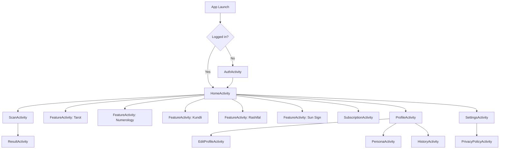

# AstroApp - App Logic and Flow

Last reviewed: March 11, 2026

## 1. Executive Summary

AstroApp is a local-first Android app that provides:
- Palm scan and palm Q&A
- Tarot reading
- Numerology
- Kundli
- Rashifal
- Sun sign analysis

The app has no dedicated backend of its own.
Most business logic runs on-device.
Persistent data is stored locally in Room.
AI requests go either:
- directly to OpenAI, or
- to a proxy URL if `OPENAI_PROXY_URL` is configured

This means the app is currently a thick-client architecture with local auth, local credits, local plans, and client-side AI orchestration.

## 2. Tech Stack

- Platform: Android, Kotlin
- Min SDK: 24
- Target SDK: 34
- Database: Room
- Async: Kotlin coroutines
- UI: XML layouts + ViewBinding
- Auth: local email/password plus Google Sign-In
- AI transport: `HttpURLConnection` against Chat Completions API
- File capture: Camera + `FileProvider`
- Localization: English and Hindi via `AppCompatDelegate.setApplicationLocales`

## 3. High-Level Architecture

## 4. Runtime Entry Flow

### 4.1 Launch
`MainActivity` is only a router.

Behavior:
- If `SessionManager.isLoggedIn` is true, route to `HomeActivity`
- Otherwise route to `AuthActivity`

There is no token refresh or remote session validation.
The logged-in state is only a locally stored user id in shared preferences.

### 4.2 Session Model
`SessionManager` stores:
- `uid`: active local user id
- `profile_prompt_deferred`: whether the profile completion prompt should be suppressed

Logout clears all session preferences.

## 5. Authentication Flow

### 5.1 Email/Password Sign Up
Behavior:
- Validates email format and password length >= 4
- Rejects duplicate email if already present in local Room DB
- Creates local `UserEntity`
- Hashes password using PBKDF2-SHA256
- Grants 10 starting credits
- Inserts a `BONUS` credit transaction for signup
- Starts local session
- Navigates to Home

Important actual rule:
- The code gives 10 free credits on sign-up
- This may differ from some UI copy that implies only 1 free question

### 5.2 Email/Password Login
Behavior:
- Looks up local user by email
- Verifies password against PBKDF2 hash
- Supports legacy hash migration on successful login
- Starts local session
- If the user is on free plan, has 0 credits, and 24 hours have elapsed since the last free top-up, grants 5 free credits

Daily free top-up conditions:
- `planType == FREE`
- `credits <= 0`
- `now - lastFreeTopupAt >= 24h`

### 5.3 Google Sign-In
Behavior:
- Uses Google Play Services
- Requests email and Google id
- If local user with the same email does not exist, creates one with password marker `google:<id>`
- Grants 10 credits for first Google sign-up
- Existing Google users also qualify for the same free-plan daily top-up logic as email users

Important limitation:
- This is local account creation after Google identity lookup
- There is no backend identity binding, token verification service, or server session

## 6. Local Data Model

The app is backed by Room database `astro_db`.

### 6.1 Tables in Use

#### `users`
Fields:
- `id`
- `name`
- `email`
- `passwordHash`
- `dob`
- `birthPlace`
- `mobile`
- `profilePhotoUri`
- `credits`
- `planType` = `FREE | BASIC | UNLIMITED`
- `planExpiry`
- `lastFreeTopupAt`

#### `history`
Stores user-visible reading history:
- `userId`
- `category`
- `question`
- `answer`
- `timestamp`

#### `credit_transactions`
Stores credit and plan movements:
- `type` = `BONUS | PURCHASED | USED | PLAN_ACTIVATED`
- `amount`
- `description`
- `timestamp`

#### `persona`
Stores optional personalization context:
- `dob`
- `relationshipStatus`
- `occupation`
- `lifeGoal`
- `biggestConcern`
- `aiSummary`
- `updatedAt`

### 6.2 Table Declared But Not Wired
There is a `ReadingCacheEntity` defined in `api/ReadingCacheEntity.kt`, but:
- it is not part of the Room database entity list
- no DAO exists for it
- no feature currently uses it

This means response caching is designed but not implemented.

## 7. Credits and Subscription Logic

Credits are the core commercial gate.

### 7.1 Shared Credit Consumption
`BaseFeatureActivity.useCredit()` applies the common rule:
- If user has active unlimited plan, allow action without deducting credits
- Still log a `USED` transaction with amount `0`
- If user has credits > 0, deduct 1 credit and log `USED` with amount `-1`
- If neither condition is met, show paywall dialog and route to `SubscriptionActivity`

### 7.2 What Costs a Credit
Actual behavior:
- Palm Q&A question: 1 credit
- Non-palm feature follow-up question: 1 credit
- Initial AI-enhanced feature reading in `FeatureActivity`: 1 credit

Important distinction:
- Palm Q&A restores the credit if the service fails or returns an empty answer
- Non-palm follow-up Q&A does not restore the credit because it always falls back to local engine answers
- Initial AI-enhanced feature readings also do not restore credit because the app falls back to local/generated reading text

### 7.3 Plans
SubscriptionActivity simulates payment and updates local DB only.
No real payment gateway is wired yet.

Plans:
- `Rs 49`: add 3 credits
- `Rs 99/month BASIC`: add 10 credits and set `planType = BASIC`
- `Rs 199/month UNLIMITED`: set `planType = UNLIMITED`, no numeric credit injection

Renewal behavior:
- Same-plan renewal extends from current expiry if plan is still active
- Otherwise renewal starts from current time

This avoids resetting active plan time on renewal.

### 7.4 Plan Enforcement
Unlimited behavior is enforced purely client-side by checking:
- `user.planType == UNLIMITED`
- `user.planExpiry > now`

There is no server verification or receipt validation.

## 8. Home / Dashboard Flow

`HomeActivity` does four main things:
- loads current user
- renders greeting and credits state
- renders subscription banner based on plan status
- prompts profile completion if DOB is blank

Navigation from Home:
- Palmistry -> `ScanActivity`
- Tarot -> `FeatureActivity(type=TAROT)`
- Numerology -> `FeatureActivity(type=NUMEROLOGY)`
- Kundli -> `FeatureActivity(type=KUNDLI)`
- Rashifal -> `FeatureActivity(type=SIGN)`
- Sun Sign -> `FeatureActivity(type=SUN_SIGN)`
- Credits banner / card -> `SubscriptionActivity`
- Profile icon -> `ProfileActivity`
- Settings icon -> `SettingsActivity`

Profile prompt rule:
- Prompt is shown when `user.dob` is blank
- Prompt can be deferred once per session preference
- Prompt does not currently validate full persona completeness

## 9. Palmistry Flow

Palmistry is the most complex feature and has a multi-stage pipeline.

### 9.1 Capture
`ScanActivity` uses:
- `TakePicture()` with `FileProvider` for full-resolution capture
- fallback to legacy camera thumbnail if full-resolution path fails

Post-capture steps:
- load and scale bitmap
- read EXIF orientation and normalize image rotation
- attempt to read EXIF flash state

### 9.2 Local Quality Gate
Before AI is called, the app runs local image checks:
- flash check if EXIF is available
- brightness threshold
- blur threshold via Laplacian variance

Outcomes:
- too dark -> block analysis
- blurry -> block analysis
- good -> enable Analyze button

### 9.3 Two-Stage AI Palm Flow

#### Stage 1: Validation Gate
Model:
- `gpt-4o-mini`

Purpose:
- verify the image is an open inner palm suitable for reading

Expected response format:
- `DECISION: VALID|INVALID`
- `REASON: ...`
- `INSTRUCTION: ...`

Special logic:
- parser accepts structured or semi-structured responses
- app contains a handedness override to avoid false rejects based only on left/right orientation assumptions

#### Stage 2: Full Palm Analysis
Model:
- `gpt-4o`

Purpose:
- produce seven strict palm reading lines for:
  - Health
  - Marriage
  - Education
  - Brain
  - Children
  - Career
  - Luck

Expected response format:
- `STATUS: OK` plus 7 lines in `CATEGORY:SCORE:INTERPRETATION`
- or `STATUS: REUPLOAD` with reason and retake instruction

### 9.4 Palm Result Screen
If parsing succeeds with 7 readings:
- app saves a scaled copy of the captured palm image to cache
- navigates to `ResultActivity`
- passes `ArrayList<PalmReading>` and optional cached palm image path

`ResultActivity` then:
- renders score cards for all 7 categories
- appends palm image into the chat area
- allows follow-up palm Q&A

### 9.5 Palm Q&A Logic
Palm Q&A behavior:
- validates that input looks like a real question
- runs gibberish detection before charging credit
- charges 1 credit through shared credit gate
- sends the full reading context plus question to OpenAI
- expects a structured answer with sections like:
  - Short Answer
  - Detailed Answer
  - The Good
  - The Bad
  - What to do
  - Conclusion

Failure handling:
- if API fails, rate limits, or returns empty answer, the app restores 1 credit
- a user-facing note is appended saying the credit was restored

Important commercial behavior:
- Palm Q&A is more defensive than other features because it refunds on service failure

### 9.6 Palm Logging
`PalmistryEventLogger` writes JSON lines to cache log file.
Examples of tracked events:
- photo captured
- quality check
- validation request/response
- analysis request/response
- parser failures
- overall timing

This is useful for debugging but is local-only.

## 10. Multi-Feature Flow: Tarot, Numerology, Kundli, Rashifal, Sun Sign

All non-palm features run inside `FeatureActivity`.

### 10.1 Shared Pattern
For each feature:
- gather user input or local derived values
- compute an immediate local result using deterministic/local engines
- show result cards immediately
- spend 1 credit for AI-enhanced reading generation
- if AI fails, show local fallback text instead
- allow follow-up Q&A, again spending credits

### 10.2 Tarot Flow
Tarot is a hybrid of local deck logic and AI enhancement.

Steps:
- draw 3 random cards from full in-memory deck
- each card may be upright or reversed
- user taps each card to reveal it
- app shows local card meaning/advice immediately
- once 3 cards are revealed, app requests an AI spread interpretation

Tarot-specific behaviors:
- in-memory `TarotSessionStore` preserves active session while app process stays alive
- if user returns to Tarot screen during same process, they can resume or reset
- AI reading is normalized into three sections:
  - What it means
  - What to do next
  - Be careful of
- if AI response is poor or missing, app generates compact local spread interpretation
- follow-up Q&A references drawn cards and prior conversation history

Important limitation:
- `TarotSessionStore` is process memory only
- session is lost on process death, force-stop, or app restart

### 10.3 Numerology Flow
Local engine computes:
- Life Path Number
- Destiny Number
- Soul Number
- Lucky Color
- Lucky Day

AI then expands the reading using name, DOB, locale, and persona context.

### 10.4 Kundli Flow
Local engine computes a simplified pseudo-Kundli using:
- DOB digit sum
- birth time digits
- birthplace string length

Outputs include:
- Rashi
- Lagna
- Nakshatra
- Name initial
- Favorable planet

Important note:
- This is a lightweight heuristic engine, not an astronomical calculation engine
- AI prompt frames it as simplified Vedic reading

### 10.5 Rashifal / Sign Flow
`SIGN` mode:
- derive zodiac sign from DOB
- show local horoscope card set
- AI prompt asks for daily horoscope expansion

`SUN_SIGN` mode:
- derive sign from DOB
- show same local sign engine result style
- AI prompt asks for personality-style sun sign reading

### 10.6 Follow-Up Q&A for Non-Palm Features
Behavior:
- uses same gibberish detector and credit gate
- builds context from AI reading if available, otherwise local result context
- sends feature-specific prompt to OpenAI
- includes recent conversation history
- updates local `conversationHistory`
- every 5 Q&A pairs, may update `persona.aiSummary`

Failure behavior:
- if AI fails, app falls back to local engines
- credit is not restored because a fallback answer is still produced

## 11. Local Engines and Business Logic Quality

### 11.1 Tarot Engine
- Full in-memory deck with hardcoded meanings and advice
- Local fallback answer picks one random drawn card and returns a practical line
- Also supports compact spread interpretation and detailed card drill-down

### 11.2 Numerology Engine
- Deterministic reduction logic
- Computes core numerology numbers from input strings
- Hardcoded meaning tables

### 11.3 Kundli Engine
- Simplified heuristic engine
- Not astronomy-backed
- Uses arithmetic over inputs to generate consistent pseudo-Vedic output

### 11.4 Sign Engine
- DOB-to-sign mapper
- Hardcoded sign metadata
- Hardcoded daily horoscope snippets by element group

### 11.5 PalmAnalyzer
There is also a legacy/local `PalmAnalyzer` that can generate pseudo-random palm readings from bitmap seed values.
Current runtime status:
- the current main palm flow uses AI vision, not `PalmAnalyzer`
- `PalmAnalyzer` appears to be legacy fallback logic, not the active pipeline

## 12. Prompt and AI Design

All prompt generation lives in `PromptTemplates`.

Shared prompt rules:
- output in English or Hindi based on locale or question script
- keep tone practical and encouraging
- avoid medical and financial certainty
- persona context is injected if present

Prompt families:
- Tarot reading
- Numerology reading
- Kundli reading
- Rashifal reading
- Sun sign reading
- Follow-up Q&A
- Persona summary generation
- Palm validation
- Palm vision analysis

## 13. AI Endpoint and Transport

### 13.1 Endpoint
Single AI endpoint in app code:
- `https://api.openai.com/v1/chat/completions`

### 13.2 Transport Selection
`OpenAIService` chooses transport in this order:
- if `OPENAI_PROXY_URL` is configured, use proxy
- otherwise, if debug build or `ALLOW_DIRECT_OPENAI` is enabled and API key exists, call OpenAI directly
- otherwise return configuration error

### 13.3 Models in Active Use
Current effective models:
- default text: `gpt-4o-mini`
- palm validation: `gpt-4o-mini`
- full palm analysis: `gpt-4o`
- palm follow-up Q&A: `gpt-4o-mini`

### 13.4 Vision Request Shape
Vision calls send:
- user text block
- `image_url` with a `data:image/jpeg;base64,...` payload
- token limit and optional temperature

### 13.5 Error and Retry Behavior
`OpenAIService` supports:
- timeout handling
- limited retries for network/timeouts
- retry on empty model response with alternate fallback model
- explicit rate-limit return type

## 14. Profile, Persona, History, Settings

### 14.1 Profile
`ProfileActivity` shows:
- user identity
- plan status
- credit summary
- transaction history
- persona summary/details

Used values include:
- current balance
- total purchased
- total bonus
- total used

Used count is derived from both transactions and current balance to avoid undercounting.

### 14.2 Edit Profile
User can update:
- name
- email
- DOB
- birth place
- mobile
- profile photo URI
- password

Business rules:
- email must be valid
- duplicate email across users is blocked
- password update is optional and re-hashed if set

### 14.3 Persona
Persona is optional but influences prompts.

User can fill:
- DOB
- relationship status
- occupation
- life goals
- concerns

Save behavior:
- at least one of DOB, relationship, or occupation must be present
- app generates an AI summary if possible
- if AI summary fails, app builds a local fallback summary

Persona also evolves over time:
- `FeatureActivity` updates persona summary every 5 Q&A exchanges if AI succeeds

### 14.4 History
`HistoryActivity` displays last 100 history items from local DB.

Current scope:
- reading history only
- transaction history is shown in Profile, not History screen

### 14.5 Settings
Settings supports:
- language switch between English and Hindi
- clear reading history
- logout
- privacy policy / terms
- delete all user data

Delete-all behavior removes:
- history
- credit transactions
- persona
- user
- current session

## 15. Privacy Policy / Terms Flow

Behavior:
- if external URL is configured and starts with `https://`, open browser
- otherwise open `PrivacyPolicyActivity`
- local screen loads bundled HTML asset or fallback HTML string

Build-config controlled values:
- `PRIVACY_POLICY_URL`
- `TERMS_URL`

## 16. Localization Logic

Language switching is app-wide and uses AppCompat locales.

Current supported languages:
- English (`en`)
- Hindi (`hi`)

Special AI behavior:
- if a user types Hindi/Devanagari in feature follow-up Q&A, the app forces Hindi answer generation even if app locale is English

## 17. Security and Compliance Notes

### 17.1 Password Storage
Good:
- PBKDF2-SHA256 with random salt and 120,000 iterations
- constant-time comparison
- successful legacy hash migration path exists

### 17.2 Client-Side Risk
Current architecture stores too much authority on device:
- auth accounts are local only
- plan activation is local only
- credits are local only
- AI secrets may live on-device in debug/direct mode

This is acceptable for prototype or internal builds, but weak for production monetization.

### 17.3 Data Storage Claim
Actual behavior is local-first.
The app currently does not operate a dedicated remote application backend.
Any external expert reviewing privacy/compliance should compare this against storefront/privacy copy.

## 18. Known Gaps / Review Points For Expert

These are likely the highest-value areas for external review.

### 18.1 Architecture / Security
- No owned backend service for auth, plans, receipts, or credits
- Client-side credits and plans are easy to tamper with on rooted/debuggable environments
- Direct OpenAI usage exposes product logic and potentially API key usage in non-proxy scenarios

### 18.2 Product / Commerce
- Payment is mocked only
- There is no store billing integration, receipt validation, renewal service, or subscription reconciliation
- Some UI copy may still imply behavior that does not match code exactly

### 18.3 AI Reliability
- Entire AI experience depends on prompt-format compliance
- Palm parser is robust but still format-sensitive
- Non-palm feature flows charge before AI call and do not refund because of local fallback
- Expert may want to confirm whether this is the desired business rule

### 18.4 Local Engine Accuracy
- Kundli and horoscope logic are heuristic, not astronomical
- Numerology is deterministic but simplistic
- Tarot deck logic is hardcoded and opinionated
- Palm local analyzer exists but is not the main production path

### 18.5 Persistence Design
- Tarot session state is only in RAM, not Room
- Reading cache entity exists but is not integrated
- History is capped to 100 rows at query time

### 18.6 Compliance / Content
- Expert should review whether advice style, disclaimers, and category outputs are suitable for app-store policy and domain expectations
- Expert should specifically review medical, financial, and relationship guidance boundaries in prompts and hardcoded fallback content

## 19. Actual Endpoints and Integrations Summary

### External network endpoints
- OpenAI Chat Completions: `https://api.openai.com/v1/chat/completions`
- Optional browser-opened privacy policy URL from build config
- Optional browser-opened terms URL from build config

### External SDK / service integrations
- Google Sign-In / Google Play Services
- Android camera + FileProvider
- OpenAI API or configured proxy

## 20. Suggested Questions For External Expert

1. Should credits be deducted before AI completion for all feature types, or should some flows use post-success charging?
2. Is client-side plan enforcement acceptable for the current business stage, or should this move behind a backend immediately?
3. Should Tarot / Kundli / Rashifal local fallback engines remain, or should all expert-facing output be unified under one stricter content layer?
4. Should tarot session state and cached readings be persisted in Room for reliability?
5. Should persona summary generation be opt-in, given it evolves over time from conversation history?
6. Should privacy/legal copy explicitly state that OpenAI may process user-provided birth details and questions?

## 21. Bottom Line

The app is functionally organized and mostly integrated, but the real production posture is still that of a prototype-heavy local client:
- all business rules live on-device
- monetization is local and mocked
- AI orchestration is client-side
- feature engines are partly deterministic and partly AI-generated

From an expert review perspective, the most important topics are:
- production hardening
- payment and credit authority
- AI policy/compliance boundaries
- consistency between product copy and actual business logic
